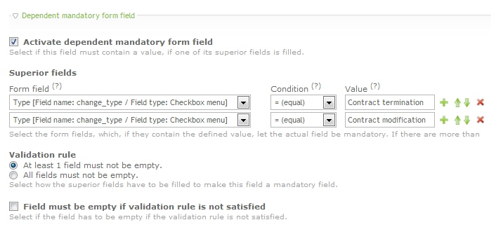
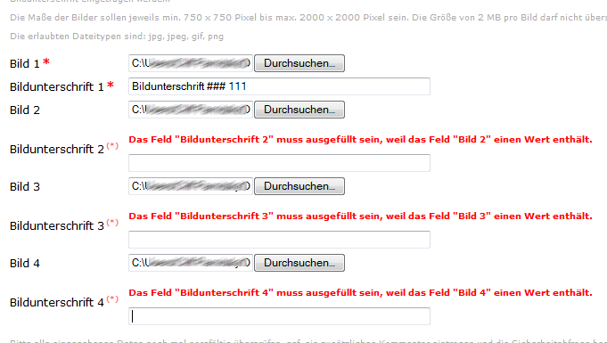
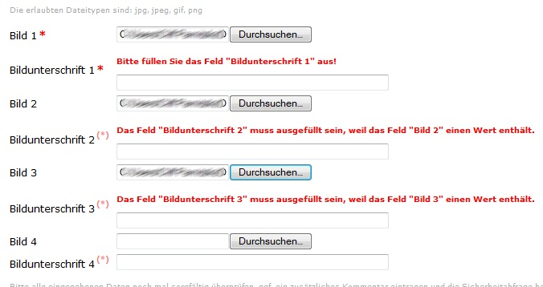

[](https://packagist.org/packages/cliffparnitzky/form-dependent-mandatory-field)
[](https://packagist.org/packages/cliffparnitzky/form-dependent-mandatory-field)
[](https://packagist.org/packages/cliffparnitzky/form-dependent-mandatory-field)

# Contao Extension: FormDependentMandatoryField

Provides an additional option for form fields to be defined as dependent mandatory. Field is mandatory, if another field (or more) is filled / or not / has a special value.

This special validation is executed server side and only available for forms with submission method `POST` (there are no settings in form fields for forms with `GET`).


## Installation

Install the extension via composer: [cliffparnitzky/form-dependent-mandatory-field](https://packagist.org/packages/cliffparnitzky/form-dependent-mandatory-field).

If you prefer to install it manually, download the latest release here: https://github.com/cliffparnitzky/FormDependentMandatoryField/releases


## Tracker

https://github.com/cliffparnitzky/FormDependentMandatoryField/issues


## Compatibility

- Contao version >= 5.3.0


## Dependency

This extension is dependent on the following extensions:

- [[menatwork/contao-multicolumnwizard-bundle]](https://packagist.org/packages/menatwork/contao-multicolumnwizard-bundle)


## Screenshots





## Additional information

### CSS Tip

Adding special CSS, will show the difference between **mandatory** and **dependent mandatory** form fields.

This is only an example:

````
label.dependent.mandatory:after {
	content: '(*)';
	font-size: 9px;
	vertical-align: super;
	color: #FF7777;
}
````

With the CSS above, a form like the following will be created:

